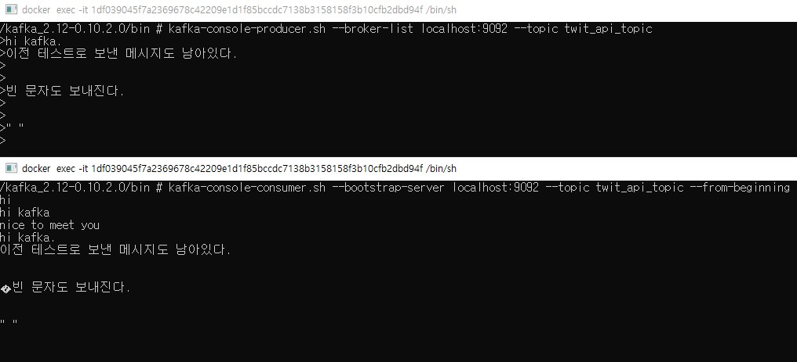
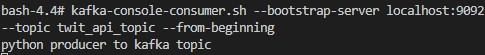
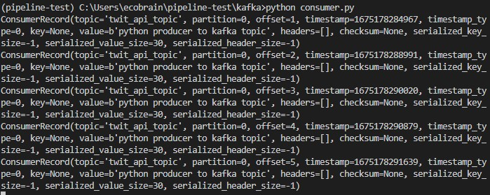

카프카를 간단하게 도커컴포즈를 활용하여 싱글노드 모드로 설치해본다.

<hr>
<br><br>

# 도커컴포즈로 카프카 설치

카프카 버전은 참고하는 블로그에서 사용하는 2.13버전을 그대로 사용하였다. 현재는 작성일 기준으로 3.3.2가 최신이자 stable로 [kafka.apache.org](https://kafka.apache.org/downloads)에 게시되었다.

- [docker-compose.yml](https://pearlluck.tistory.com/638?category=935063)

```yml docker-compose.yml
version: "2"
services:
  zookeeper:
    container_name: local-zookeeper
    image: wurstmeister/zookeeper:3.4.6
    ports:
      - "2181:2181"

  kafka:
    container_name: local-kafka
    image: wurstmeister/kafka:2.12-2.3.0
    depends_on:
      - zookeeper
    ports:
      - "9092:9092"
    environment:
      KAFKA_ADVERTISED_HOST_NAME: 127.0.0.1
      KAFKA_ADVERTISED_PORT: 9092
      KAFKA_CREATE_TOPICS: "twit_api_topic:1:1" # topic name:partition numbers:replica numbers
      KAFKA_ZOOKEEPER_CONNECT: zookeeper:2181
    volumes:
      - /var/run/docker.sock:/var/run/docker.sock
```

주키퍼 서버를 2181, 카프카 싱글클러스터 서버로 9092를 열어주었다.

카프카 환경변수에는 `twit_api_topic`을 바로 생성하는 환경변수를 주입했다.

topic은 카프카 브로커서버에서 아래와 같이 cli로도 생성할 수 있다.

```cmd
bash4.4# kafka-topics.sh --create --bootstrap-server localhost:9092 --topic twit_api_topic --partitions 1 --replication-factor 1
```

도커 컴포즈를 실행시키고, kafka 컨테이너에 터미널로 접근한다.

```cmd
$ docker-compose -f docker-compose.yml up  # 백그라운드 실행을 하려면, -d 데몬 옵션을 준다
$ docker exec -it local-kafka bash  # local-kafka 컨테이너 bash 접근
```

카프카 컨테이너 접근하여 kafka 실행파일 설치한다.

```cmd
bash-4.4# cd /
bash-4.4# wget https://archive.apache.org/dist/kafka/0.10.2.0/kafka_2.12-0.10.2.0.tgz
bash-4.4# ls
bin                      kafka                    media                    root                     sys
dev                      kafka_2.12-0.10.2.0.tgz  mnt                      run                      tmp
etc                      lib                      opt                      sbin                     usr
home                     lib64                    proc                     srv                      var

bash-4.4# tar -zxvf kafka_2.12-0.10.2.0.tgz
bash-4.4# cd kafka_2.12-0.10.2.0/bin
bash-4.4# kafka-topics.sh --list --bootstrap-server localhost:9092  # localhost:9092 포트에 생성된 topic 리스트 확인
twit_api_topic
```

`kafka-topics.sh`로 도커컴포즈에서 주입한 topic이 잘 생성되었는지 확인되었다.

> `bootstrap-server`로 열었으나, 주키퍼를 사용하는 경우에는 `kafka-topics.sh --list --zookeeper <zookeeper_host:port>`로 접근 가능하다고 한다. 두 차이는 추후에 정리해본다.

## CLI Kafka 테스트

카프카를 테스트 하기위해 새로운 터미널을 열고 프로듀서, 컨슈머를 시작해보자.

### 프로듀서 만들기

`kafka-console-producer.sh` 로 콘솔 테스트가 가능하다.

```cmd
bash-4.4# kafka-console-producer.sh --broker-list localhost:9092 --topic twit_api_topic
```

### 컨슈머 만들기

```cmd
bash-4.4# kafka-console-consumer.sh --bootstrap-server localhost:9092 --topic twit_api_topic --from-beginning
```

위와 같이 작동한 후에 프로듀서 콘솔 창에 메시지를 입력하게 되면 컨슈머 콘솔에서 응답을 받을 수 있다.

한글메시지는 간헐적으로 깨지기도 한다. 이를 방지하기 위해 인코딩 설정을 별도로 하기도 하고 메시지는 byte로 보내는 것이 좋다고 한다.



기존 토픽에 남은 레코드를 삭제하는 방법은 먼저 `config/server.properties`에서 delete.topic.enable=true를 추가한다.

그리고 아래와 같이 topic의 레코드를 지워준다.

```cmd
# kafka-topics.sh -- --delete --topic {topicname}
bash-4.4# kafka-topics.sh --bootstrap-server localhost:9092 --delete --topic twit_api_topic
```

다른 방법으로는 삭제 주기 옵션을(retention.ms) 1초 가량으로 줄이고 다시 복구한 후 시작하면 된다.

```cmd
bash-4.4# kafka-topics.sh --bootstrap-server --alter --topic twit_api_topic --config retention.ms=1000
```

## Kafka-python

카프카 프로듀서와 컨슈머 개발을 파이썬에서도 가능하다.

카프카를 지원하는 파이썬 라이브러리로는 `kafka-python`, `confluent-kafka`가 대표적인 듯 하다.

그 중에 github star가 더 많은 `kafka-python`을 활용하기로 해본다.

우선 `kafka-python` 라이브러리를 설치하자.

```bash
pip install kafka-python
```

앞서 도커컴포즈에 띄운 싱글노드 카프카 브로커에 간단한 메시지를 보내는 Producer 스크립트를 작성해본다.

### python producer

```python producer.py
from kafka import KafkaProducer

# kafka config
producer = KafkaProducer(bootstrap_servers=["localhost:9092"])

# 토픽 메시지 전송(메시지 전달시 보통 byte로 보내는 것이 좋음)
producer.send(topic="twit_api_topic", value=b"python producer to kafka topic")
producer.flush()
```

재밌는건 DB에서 insert를 발생시키는 flush()를 명령어로 사용한다.
send 만으로는 큐에 저장하진 않는가보다. 추후에 구조를 알아보도록 해야겠다.

위의 `producer.py`를 실행시키고 console consumer `kafka-console-consumer.sh`로 확인해보면 잘 들어와있다.



### python consumer

이 메시지를 받을 consumer 또한 파이썬으로 작성 가능하다.

```python consumer.py
from kafka import KafkaConsumer

# kafka config, producer와는 반대로 토픽을 먼저 정의
consumer = KafkaConsumer("twit_api_topic", bootstrap_servers=["localhost:9092"])

# consumer는 generator
for msg in consumer:
    print(msg)
```

`consumer.py`에 작성한 위 코드를 실행시키면, 무한루프가 돌면서 `producer.py`를 실행할 때 마다 데이터를 받아오게 된다.



받아오는 데이터는 ConsumerRecord 객체로 partition, offset, timestamp 등의 정보와 value에 메시지가 담긴다.

ConsumerRecord 객체에 대한 내용과 자세한 과정은 다음 글에서 작성해보겠다.

<!-- 이제 twitter stream API를 Kafka로 stream으로 받아보자. -->

### 참고

> https://pearlluck.tistory.com/638?category=935063
